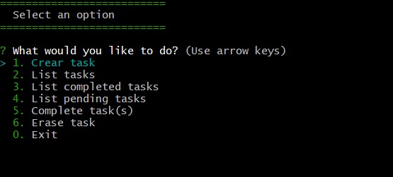

# Interactive console: To do tasks

Small console program developed as practice in Node JS, for the creation of tasks to do and you can complete them, list them or even delete them as needed.

# Instructions for instalation

## 1. Download or clone the repository

-   Select on your computer a clean file where you can place the project
-   Open CMD or git bash
-   Run the following command

          cd "Path-of-your-clean-file"

-   Clone the proyect with the following command

          git clone https://gitlab.com/wilkinjsvsquez/nodejs-udemy.git

## Install dependencies

-   Once the project is cloned, on the terminal access to the file called "04-Tareas-Hacer"

          cd /04-tareas-hacer

-   Install the dependencies

          npm install

## Run the project

-   Run the following command to start the project

          node app.js

# This is how the project looks

<!---->

