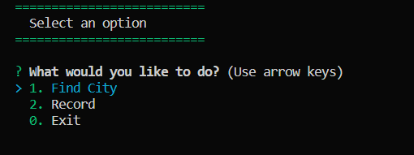
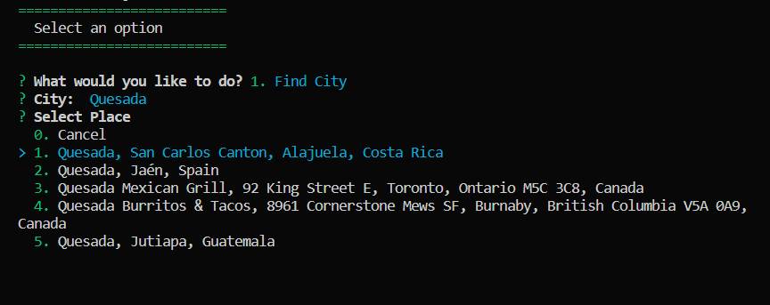
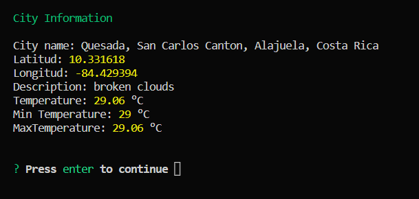
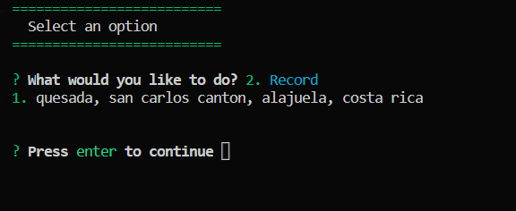

# Interactive console: Weather App

Small console program developed as practice in Node JS, for the creation of tasks to do and you can complete them, list them or even delete them as needed.

# Instructions for instalation

## 1. Download or clone the repository

- Select on your computer a clean file where you can place the project
- Open CMD or git bash
- Run the following command

        cd "Path-of-your-clean-file"

- Clone the proyect with the following command

        git clone https://gitlab.com/wilkinjsvsquez/nodejs-udemy.git

## Install dependencies

- Once the project is cloned, on the terminal access to the file called "04-Tareas-Hacer"

        cd /05-weather-app

- Install the dependencies

        npm install

- On the Main folder please create a .env file where you should have the keys of the API Pages (Mapbox and OpenWeather) and place your tokens on it

  - EXAMPLE:

    MAPBOX_KEY={YOUR_MAPBOX_KEY}
    OPENWEATHER_KEY={YOUR_OPENWEATHER_KEY}

## Run the project

- Run the following command to start the project

        node index.js

# This is how the project looks

<!---->

## Main Menu

## City Finder

## Cities Result

## Record of the cities

